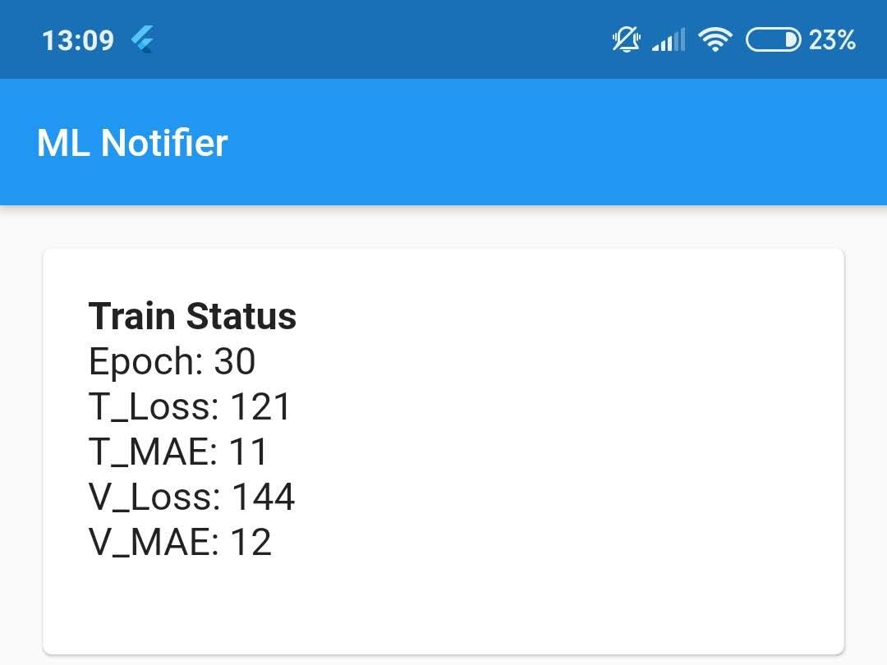
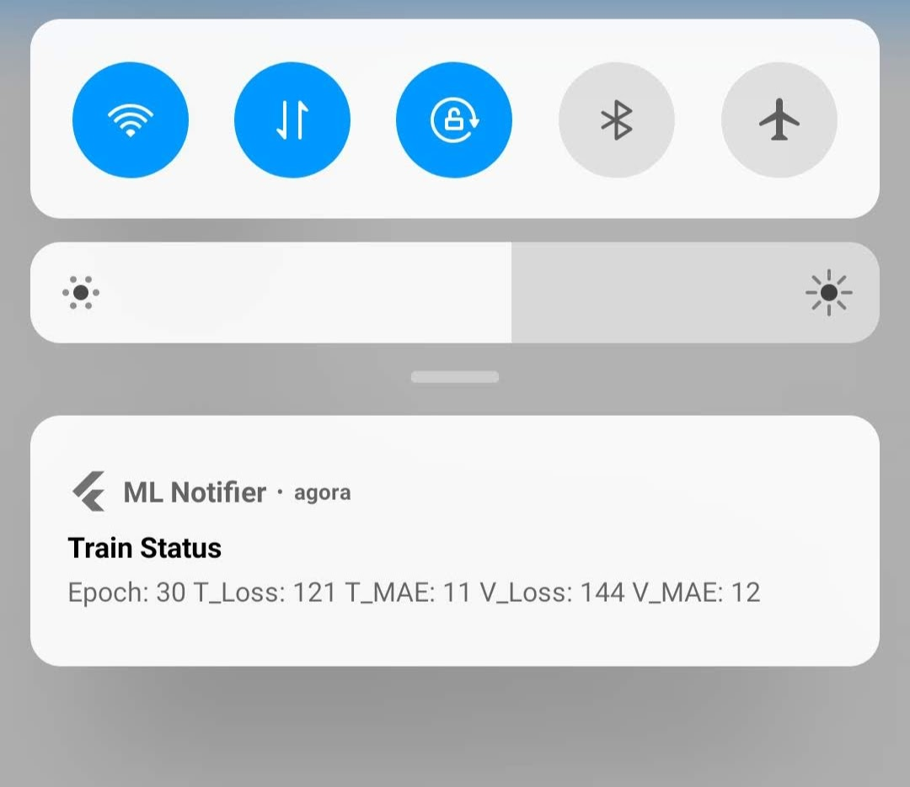
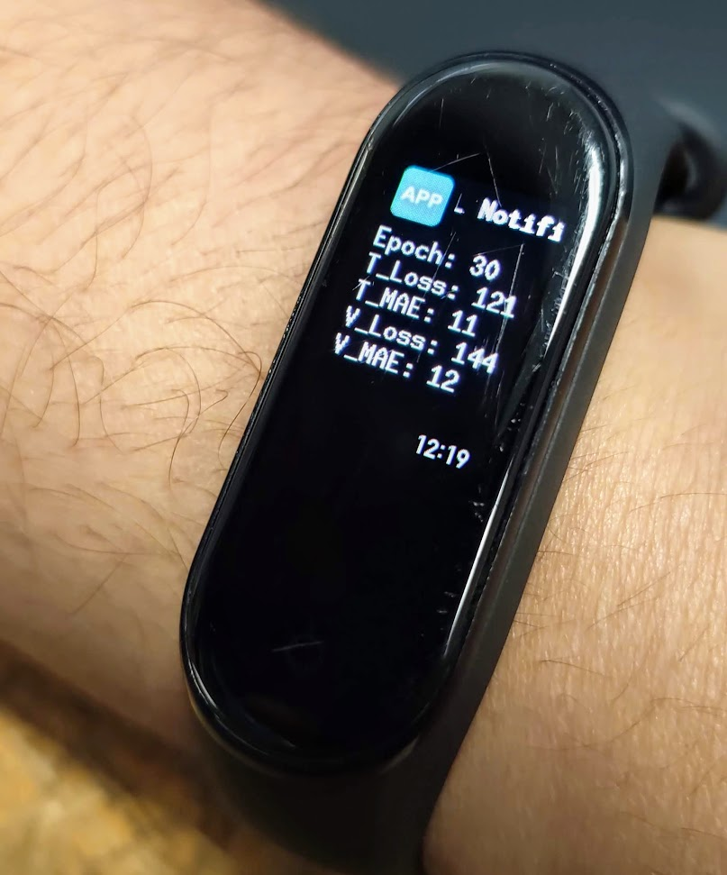

# Flutter Firebase Cloud Messaging Receiver

A Flutter app to receive Firebase Cloud Messaging notifications. It was built to be used with [Firebase Cloud Messaging Notifier](https://github.com/bryanlincoln/fcm-notifier), a package I made to notify about Machine Learning models training status.

  

> App's view (left), notification center (center) and smartband (right). This is the way I use it.

The main motivation is that monitoring machine learning models' training status can be time consuming (specially when SSH-ing from the phone). Using this, monitoring becomes passive.

## Requirements

-   [Flutter](https://flutter.dev/)
-   A Firebase Cloud Messaging project token (see https://firebase.google.com/docs/cloud-messaging)

## Usage

-   Clone this repository
-   Download `google-services.json` from your Firebase project and place it in `android/app`
-   Connect your phone to your computer and run `flutter run`
-   On the app, click the floating button to copy your device's token
-   Use the token to send notifications to your phone via [FCM Notifier](https://github.com/bryanlincoln/fcm-notifier)

## Contributing

This app (and [Python package](https://github.com/bryanlincoln/fcm-notifier)) are far from complete. There are some ways I imagine they could be better:

-   Saving historic data, when new notifications arise
-   Automatic device token synchronization between phone and reporter machine
-   Easier project configuration, using some service other than Firebase.

Fell free to fork this project and improve it for your needs.

## Credits

-   [Flutter FCM](https://github.com/Kashifalaliwala/Flutter-FCM) was used as a starting point for notification handling.
